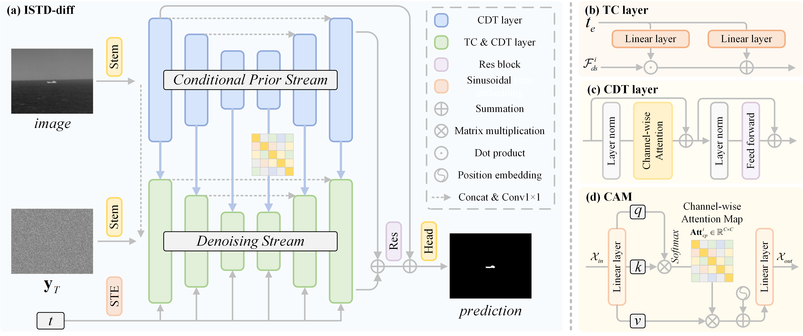

# ISTD-diff-Infrared-Small-Target-Detection-via-Conditional-Diffusion-Models
### Welcome to keep following our repository.

> **Abstract:** Infrared small target detection (IRSTD), which is to extract tiny and dim targets that are hidden in noisy and messy backgrounds, is a challenging task in computer vision. Inspired by the recently powerful deep generative models, we formulate the IRSTD as a generative task and design a conditional denoising model termed ISTD-diff to iteratively generate the target mask from the noisy one. In addition, ISTD-diff employs a two-pathway architecture, consisting of a conditional prior (CP) stream for encoding the input infrared image prior and a denoising (DE) stream for cleaning up the noisy masks. Both streams are equipped with several cascaded innovative channel-dimension transformer (CDT) layers, which capture the global correlations efficiently and reduce computational demands effectively. Moreover, to strengthen the denoising learning process, we proposed a simple but powerful method named attention injection module (AIM), which provides detailed control over the DE stream. Extensive experiments finely demonstrate the superior performance of our ISTD-diff beyond the current representative segmentation-based state-of-the-art (SOTA) algorithms.

## ISDT-diff Framework:


## Create Environment:
- Python 3 (Recommend to use Anaconda)
- PyTorch >= 1.3
- NVIDIA GPU + CUDA
- Python packages:
```python
  pip install -r requirements.txt
```

## Test:
```
    python test_diff.py
```
